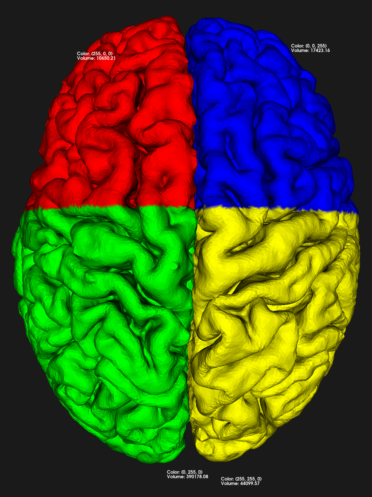
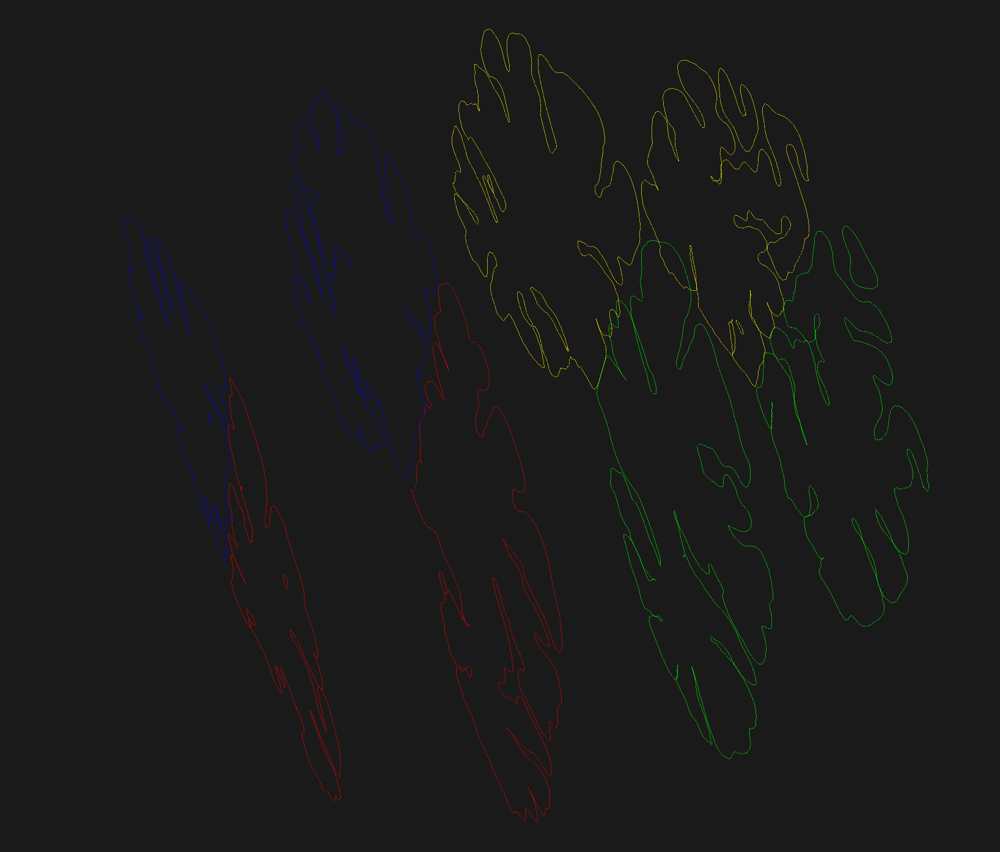
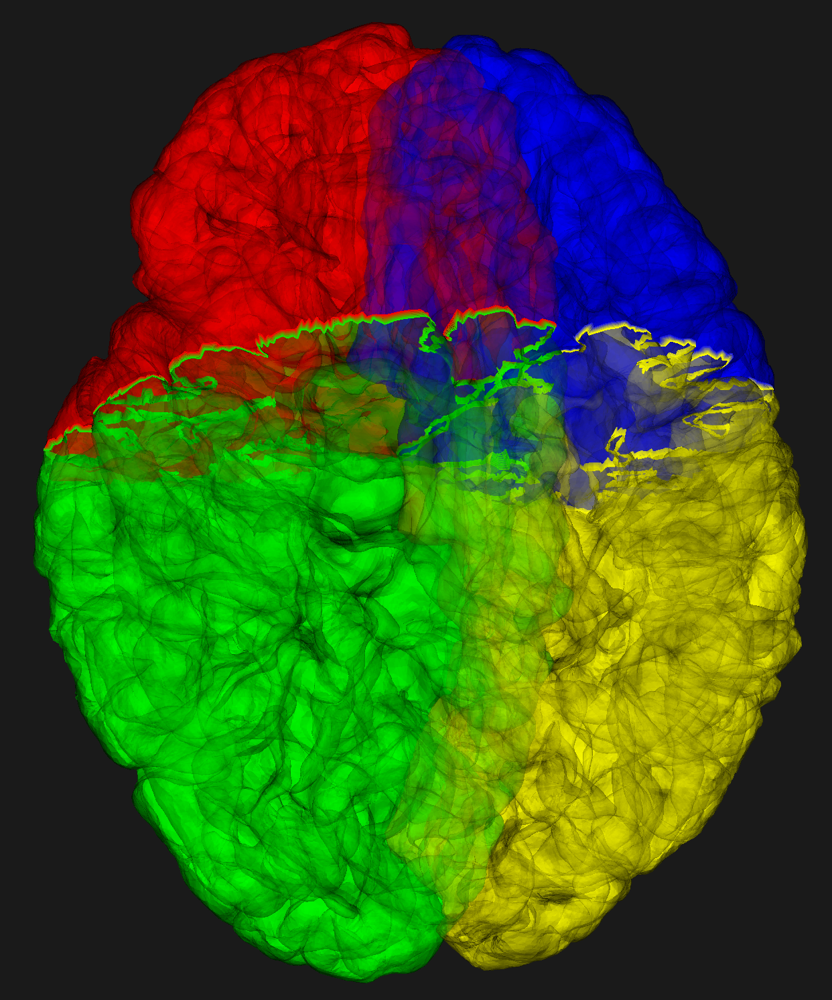

# CS6357FinalProject

## Holographic Visualization and Quantitative Analysis of Brain Imaging Data

### Overview

This repository provides a Python-based framework for processing, visualizing, and analyzing brain hemisphere data using **VTK (Visualization Toolkit)**. The project combines quantitative analytics with advanced 3D holographic visualization to enhance interpretability of brain imaging datasets.

Key features include:
- Brain data segmentation into four regions (Left-Front, Left-Back, Right-Front, Right-Back).
- Volumetric, surface area, and centroid-based calculations.
- Enhanced rendering of brain models for interactive visualization using VTK and Looking Glass holographic display.

For details about the project objectives and methods, refer to the full project report:
[Holographic Visualization and Quantitative Analysis of Brain Imaging Data](./CS6357_FinalProject.pdf).

---
### Demo link:
Holographic Display Demo: https://youtu.be/X9WPEu3k1sg

## Features

### Data Processing
1. **Segmentation**:
   - Brain imaging data is divided into four quadrants using spatial coordinates and color-coded with distinct RGB values.
2. **Combination**:
   - Merges segmented hemispheres into a single polydata for unified analysis.
3. **File Conversion**:
   - Outputs in `.vtk`, `.stl`, and `.ply` formats for use in analysis and rendering workflows.

### Quantitative Analytics
1. **Volume and Surface Area Calculations**:
   - Volumes and surface areas for each region are computed using VTK’s triangulation and mass property tools.
2. **Spatial Properties**:
   - Centroids and principal axes are calculated using eigenvalues and eigenvectors derived from spatial data.
3. **Density Analysis**:
   - Point and cell counts for each region to measure spatial density.

### Visualization
1. **3D Rendering with VTK**:
   - Region-specific rendering with labels showing metrics like volume and centroid.
2. **Slicing and Isolines**:
   - Interactive slice visualizations with isolines for structural clarity.
3. **Holographic Display Integration**:
   - Rendered `.ply` models displayed interactively on the Looking Glass Portrait device.

---

## File Structure

```plaintext
.
├── data/
│   ├── lh.pial.vtp            # Left hemisphere input
│   ├── rh.pial.vtp            # Right hemisphere input
├── output/
│   ├── brain_merged.vtk       # Combined hemispheres (uncolored)
│   ├── brain_merged_colored.vtk  # Combined hemispheres (colored)
│   ├── uncolored_brain.stl    # STL file for 3D printing
│   ├── colored_brain.ply      # Colored brain in PLY format
│   ├── final_segmented_brain.ply # Quadrant-based segmentation with region-specific metrics
├── SourceCode.ipynb           # Jupyter Notebook for full workflow
├── CS6357_FinalProject.pdf    # Full project report
└── README.md                  # Documentation
```

---

## Requirements

- **Python 3.7 or later**
- **VTK (Visualization Toolkit)**: For data processing and rendering.
- **Numpy**: For numerical operations.
- **Jupyter Notebook**: For interactive execution.

### Install Dependencies

```bash
pip install vtk numpy notebook
```

---

## How to Run

### Prepare the Input Data
1. Place the `.vtp` files (`lh.pial.vtp` and `rh.pial.vtp`) in the `data/` directory.

### Run the Notebook
1. Open a terminal or Anaconda prompt.
2. Navigate to the project directory:
   ```bash
   cd /path/to/CS6357FinalProject
   ```
3. Launch Jupyter Notebook:
   ```bash
   jupyter notebook
   ```
4. Open `SourceCode.ipynb` and execute cells sequentially to process, analyze, and render the brain data.

---

## Outputs

### Generated Files
1. **`brain_merged.vtk`**:
   - Merged hemispheres without color.
2. **`uncolored_brain.stl`**:
   - STL format of the merged brain.
3. **`brain_merged_colored.vtk`**:
   - Merged hemispheres with color segmentation.
4. **`colored_brain.ply`**:
   - Colored regions for holographic visualization.
5. **`final_segmented_brain.ply`**:
   - Quadrant-based segmentation with calculated properties.

### Visualization Screenshots
1. **Full Brain with Labels**:
   - **Description**: Displays brain regions with color-coded labels showing metrics.
   - **Image**:  
     
2. **Isolines Visualization**:
   - **Description**: Cross-sectional slices with isolines for structural clarity.
   - **Image**:  
     
3. **Full Brain with Reduced Opacity**:
   - **Description**: Transparent brain model with isoline overlays.
   - **Image**:  
     

---

## Citation

Please cite the following report for details about the methodology and results:

```
Aparna Kuppa and Sandhya Venkataramaiah, “Holographic Visualization and Quantitative Analysis of Brain Imaging Data,” Vanderbilt University, CS6357 Final Project. Available at: https://github.com/Sandhya-VA/CS6357FinalProject/.
```

References:
1. Schroeder, W., Martin, K., and Lorensen, B. *The Visualization Toolkit (4th ed.)*. Kitware, 2006. ISBN: 978-1-930934-19-1.
2. [Looking Glass Factory Documentation](https://docs.lookingglassfactory.com/).
3. [Looking Glass Bridge](https://docs.lookingglassfactory.com/software-tools/looking-glass-bridge).

---
