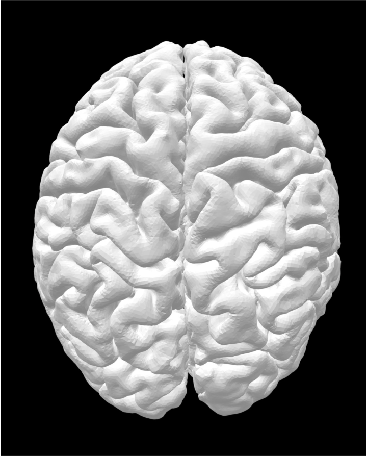
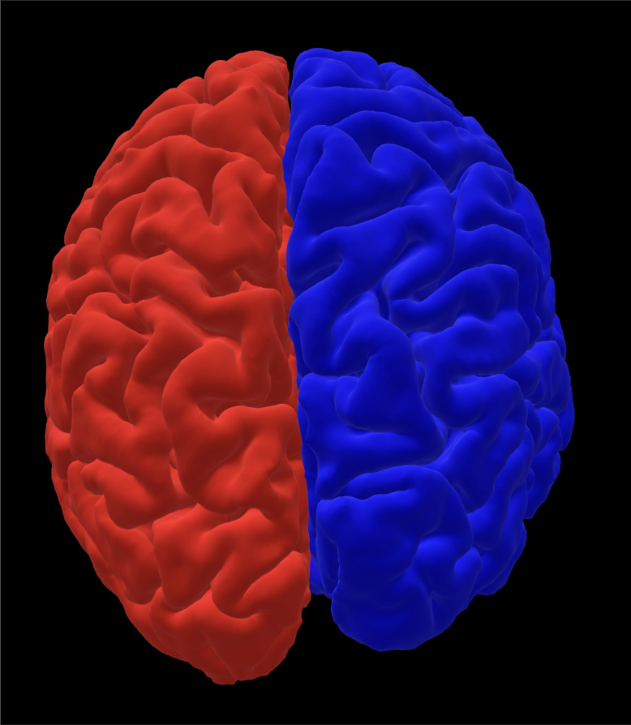
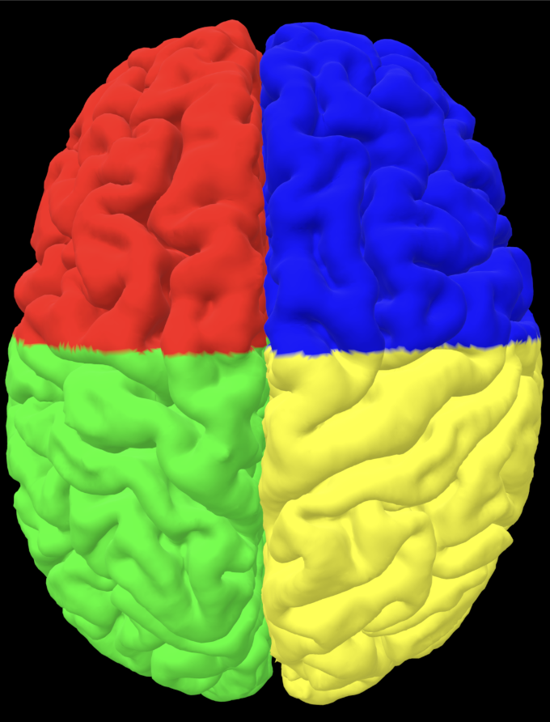

# CS6357FinalProject

## Holographic Visualization and Quantitative Analysis of Brain Imaging Data

### Overview

This repository provides a Python-based framework for processing, visualizing, and analyzing brain hemisphere data using **VTK (Visualization Toolkit)**. The code handles merging, coloring, and rendering 3D brain models from `.vtp` files and performs analytics like region statistics, PCA, volume, and surface area computation.

Key features include:
- Combining left and right hemisphere data.
- Applying distinct colors to regions for enhanced visualization.
- Exporting models to various formats (`VTK`, `STL`, `PLY`).
- Generating isoline and slice-based visualizations.
- Performing advanced analytics (PCA, volume, and surface area computations).

---

## Features

1. **Data Processing**:
   - Merge `.vtp` files for left and right hemispheres into a unified `.vtk` file.
   - Assign colors to brain regions for better distinction.
   - Export models to `.stl` (3D printing) and `.ply` (colored visualization) formats.

2. **Analytics**:
   - Calculate:
     - Volume of each brain region.
     - Surface area of regions using filtered data.
     - Principal Component Analysis (PCA) for geometric insights.
   - Provide labeled isoline visualizations for cross-sectional views.

3. **Visualization**:
   - Full 3D model rendering with region-wise colors and labels.
   - Slice-based rendering for specific brain sections.
   - Enhanced isoline visualizations with color-coded boundaries.

---

## File Structure

```plaintext
.
├── data/
│   ├── lh.pial.vtp           # Left hemisphere input data
│   ├── rh.pial.vtp           # Right hemisphere input data
├── output/
│   ├── brain_merged.vtk      # Merged hemispheres (uncolored)
│   ├── uncolored_brain.stl   # Surface model in STL format
│   ├── brain_merged_colored.vtk  # Merged hemispheres with colors
│   ├── colored_brain.ply     # Intermediate colored PLY file
│   ├── final_segmented_brain.ply # Final processed brain model with segmentation
├── sourcecode.py             # Main Python script
└── README.md                 # Documentation for the project
```

---

## Requirements

The following dependencies are required to run this project:

- **Python 3.7 or later**
- **VTK (Visualization Toolkit)**: A library for 3D computer graphics, image processing, and visualization.
- **Numpy**: For performing PCA and other numerical computations.

### Install Dependencies

To install the required libraries, run the following command:

```bash
pip install vtk numpy
```

---

## How to Run

### Prepare the Input Data

- Place the `.vtp` files (`lh.pial.vtp` and `rh.pial.vtp`) in the `data/` directory.

### Ensure Output Directory

- Ensure the `output/` directory exists or create it:

```bash
mkdir output
```

### Run the Python Script

- Execute the `sourcecode.py` script:

```bash
python sourcecode.py
```

### Check Outputs

- The processed files will be saved in the `output/` directory.
- Visualizations will be rendered interactively during the execution.

---

  ## Outputs

### Generated Files
1. **`brain_merged.vtk`**: 
   - Merged hemispheres without color.

2. **`uncolored_brain.stl`**:
   - Surface model for 3D printing.
   - **Visualization**:
     

3. **`brain_merged_colored.vtk`**:
   - Merged hemispheres with distinct region colors.

4. **`colored_brain.ply`**:
   - PLY file with color mapping for visualization.
   - **Visualization**:
     

5. **`final_segmented_brain.ply`**:
   - Segmented brain model with region-specific data.
   - **Visualization**:
     

---

## VTK Rendering Screenshots
### Visualization Screens
1. **Merged Hemispheres**:
   

2. **Colored Regions**:
   

3. **Isoline Visualizations**:
   

4. **Sliced Views**:
   

---

## Acknowledgements

- **VTK Library**: For its extensive support for 3D computer graphics and visualization.
- **Python Community**: For providing tools and resources to simplify development.
- **CS6357 Course**: For inspiration and guidance in understanding holographic visualization and quantitative analysis techniques.
